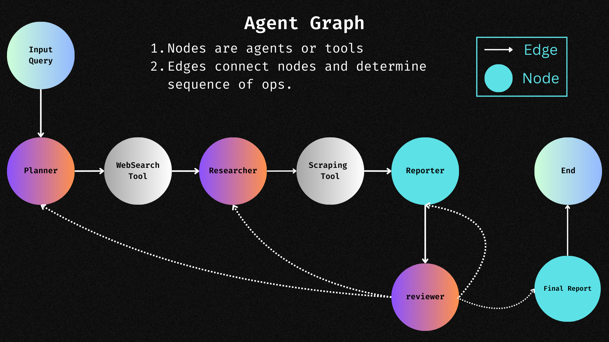

# Custom WebSearch Agent with LangGraph

### Watch the Tutorial:
[](https://www.youtube.com/watch?v=R-o_a6dvzQM)

### Agent Schema:


### Prerequisites

#### Environment Setup
1. **Install Anaconda:**  
   Download Anaconda from [https://www.anaconda.com/](https://www.anaconda.com/).

2. **Create a Virtual Environment:**
   ```bash
   conda create -n agent_env python=3.11 pip
   ```
   
3. **Activate the Virtual Environment:**
   ```bash
   conda activate agent_env
   ```

### Clone and Navigate to the Repository
1. **Clone the Repo:**
   ```bash
   git clone https://github.com/john-adeojo/graph_websearch_agent.git
   ```

2. **Navigate to the Repo:**
   ```bash
   cd /path/to/your-repo/graph_websearch_agent
   ```

3. **Install Requirements:**
   ```bash
   pip install -r requirements.txt
   ```

### Configure API Keys
1. **Open the `config.yaml`:**
   ```bash
   nano config.yaml
   ```

2. **Enter API Keys:**
   - **Serper API Key:** Get it from [https://serper.dev/](https://serper.dev/)
   - **OpenAI API Key:** Get it from [https://openai.com/](https://openai.com/)
   - **Gemini API Key:** Get it from [https://ai.google.dev/gemini-api](https://ai.google.dev/gemini-api)
   - **Claude API Key:** Get it from [https://docs.anthropic.com/en/api/getting-started](https://docs.anthropic.com/en/api/getting-started)
   - **Groq API Key:** Get it from [https://console.groq.com/keys](https://console.groq.com/keys)

### Run the front end
If you want to run the front end

For Windows, run:
```powershell
cd app
./run_windows.ps1
```

For Linux/macOS, run:
```bash
cd app
chmod +x run_linux.sh
./run_linux.sh
```

### Run Your Query In Shell
```bash
python -m app.app
```
Then enter your query.

## If you want to work with Ollama

### Setup Ollama Server
1. **Download Ollama:**
   Download [https://ollama.com/download](https://ollama.com/download)

2. **Download an Ollama Model:**
   ```bash
   curl http://localhost:11434/api/pull -d "{\"name\": \"llama3\"}"
   ```
Ollama [API documentation](https://github.com/ollama/ollama/blob/main/docs/api.md#list-local-models)

#### Video on how I integrated the Ollama Server:

[](https://youtu.be/tVcOU054iWA)

